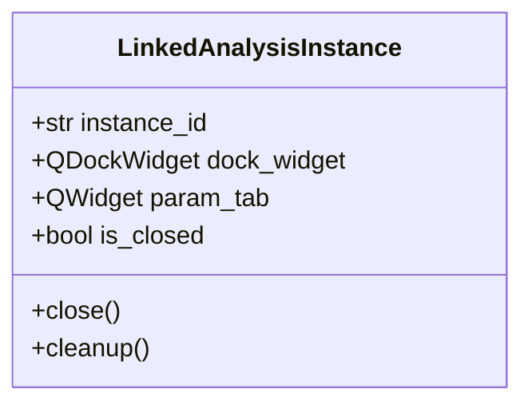
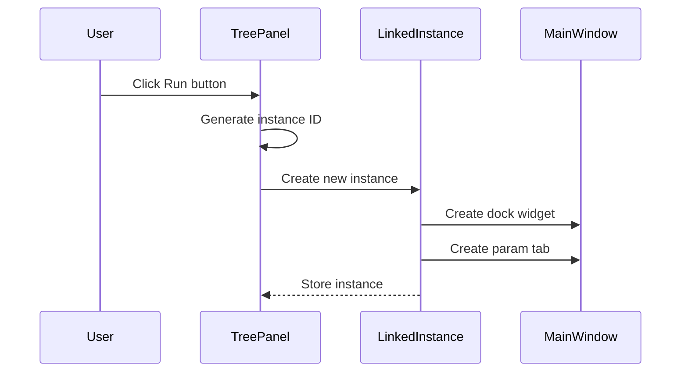
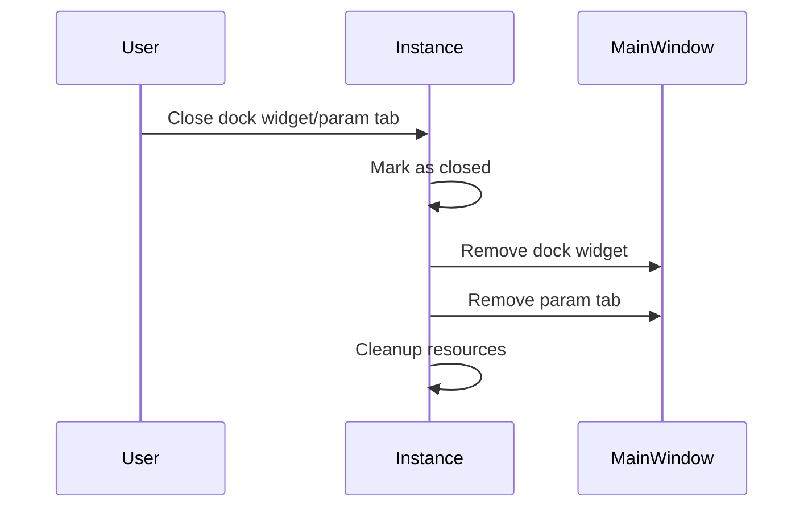

# Analysis Instances Implementation Plan

## Overview

We need to implement support for multiple instances of analysis scripts with linked dock widgets and parameter tabs.

## Class Design



## Components

1. Instance Management in TreePanelWidget:
```python
self._instance_counter = 0 
self._analysis_instances = {}  # instance_id -> LinkedAnalysisInstance
```

2. Instance Creation Flow


3. Cleanup Flow


## Implementation Steps

1. Create LinkedAnalysisInstance class to manage linked UI components:
   - Track instance_id, dock_widget, and param_tab
   - Handle synchronized closing of both components
   - Clean up resources when closed

2. Update TreePanelWidget:
   - Add instance counter and tracking
   - Generate unique IDs for each analysis instance
   - Store and manage LinkedAnalysisInstance objects

3. Modify _show_example_analysis:
   - Create new instance with unique ID
   - Create dock widget and parameter tab
   - Link components through LinkedAnalysisInstance
   - Handle component closure and cleanup

4. Add event handlers:
   - Connect dock widget and param tab close events
   - Trigger cleanup when either component is closed
   - Remove instance tracking when cleaned up

## Next Steps

1. Switch to Code mode to implement these changes
2. Add the LinkedAnalysisInstance class
3. Update TreePanelWidget with instance management
4. Test multiple instances and cleanup