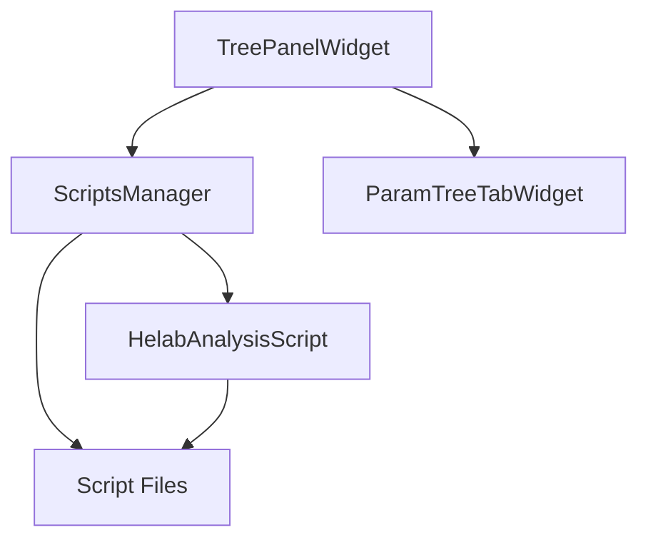

# Script System Architecture Review

## 1. System Architecture Overview



The script system is built around several key components that work together to provide a flexible and extensible analysis framework:

- **TreePanelWidget**: UI component for script management
- **ScriptsManager**: Core manager for loading and organizing scripts
- **HelabAnalysisScript**: Base class defining the script interface
- **ParamTreeTabWidget**: Parameter management component

## 2. Key Components Analysis

### 2.1 TreePanelWidget (ScriptTreeSelector.py)
- Primary UI component for script selection and management
- Features:
  - Group-based script organization
  - Dynamic script loading
  - Action button creation and management
  - Example script support
- Manages two types of groups: "dynamic" and "example"

### 2.2 ScriptsManager (scripts_manager.py)
- Core script management functionality
- Responsibilities:
  - Dynamic script loading from directories
  - Script metadata management
  - Group organization
  - Script class instantiation

### 2.3 HelabAnalysisScript (base.py)
- Abstract base class for all analysis scripts
- Key methods:
  - get_metadata(): Script information
  - get_actions(): Available actions
  - execute_action(): Action execution

### 2.4 ParamTreeTabWidget
- Parameter management interface
- Supports:
  - Multiple parameter types
  - Nested parameter groups
  - Dynamic parameter updates

## 3. Current Implementation Review

### 3.1 Strengths
1. **Flexible Architecture**
   - Easy to add new scripts
   - Clear separation of concerns
   - Extensible action system

2. **Strong Organization**
   - Group-based script management
   - Clear metadata structure
   - Robust error handling

3. **User Interface**
   - Intuitive tree-based navigation
   - Dynamic button creation
   - Parameter management support

### 3.2 Areas for Attention
1. **Error Handling**
   - Script loading errors could be more informative
   - UI feedback for failed actions could be improved

2. **Script Management**
   - No hot-reloading of modified scripts
   - Limited script dependency management

3. **Parameter System**
   - Basic parameter validation only
   - Limited parameter persistence

## 4. Potential Improvements

### 4.1 Short-term Improvements
1. **Enhanced Error Handling**
   ```python
   try:
       script.execute_action(action)
   except Exception as e:
       show_error_dialog(f"Action failed: {str(e)}")
       log_error_details(e)
   ```

2. **Script Hot-reloading**
   - Add file system watcher for script directories
   - Implement reload mechanism for modified scripts

3. **Parameter Validation**
   - Add parameter type validation
   - Implement parameter range checking
   - Add parameter persistence

### 4.2 Long-term Enhancements
1. **Script Dependencies**
   - Implement dependency declaration in script metadata
   - Add dependency resolution system
   ```python
   @dataclass
   class ScriptMetadata:
       dependencies: List[str] = field(default_factory=list)
   ```

2. **Advanced Parameter System**
   - Add custom parameter types
   - Implement parameter presets
   - Add parameter value history

3. **Script Documentation**
   - Add integrated documentation viewer
   - Generate documentation from script metadata
   - Add example usage section

## 5. Implementation Priority

1. High Priority
   - Enhanced error handling
   - Basic parameter validation
   - Script hot-reloading

2. Medium Priority
   - Parameter persistence
   - Dependency management
   - Documentation improvements

3. Low Priority
   - Advanced parameter system
   - Custom parameter types
   - Parameter history

## 6. Next Steps

1. Create detailed implementation plans for high-priority improvements
2. Set up automated testing for new features
3. Update documentation as changes are implemented
4. Consider user feedback for additional improvements